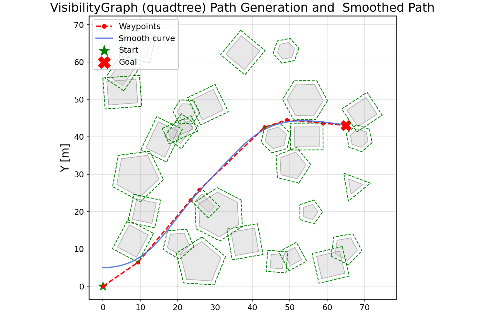
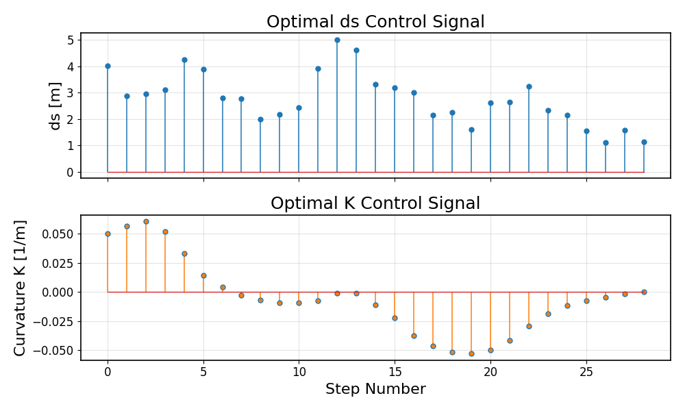
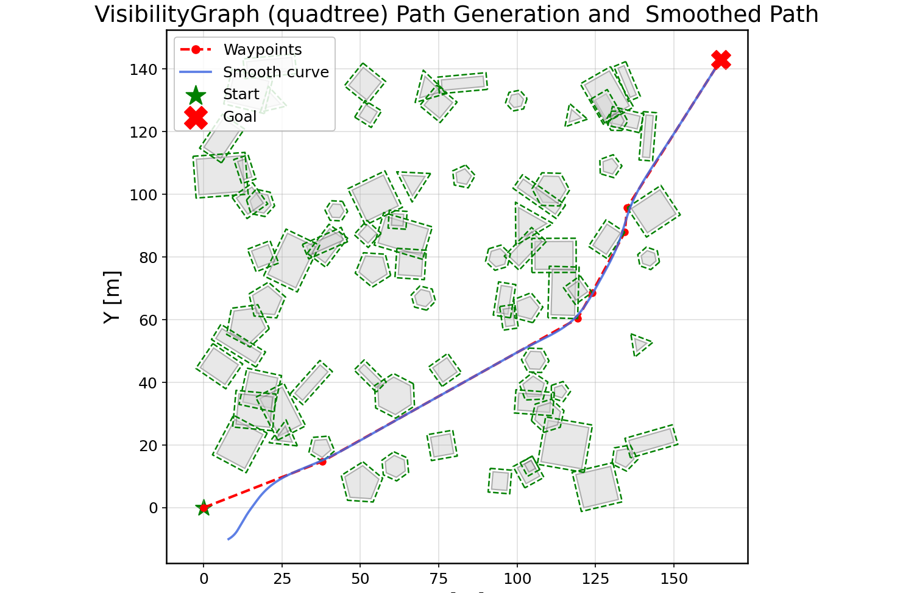
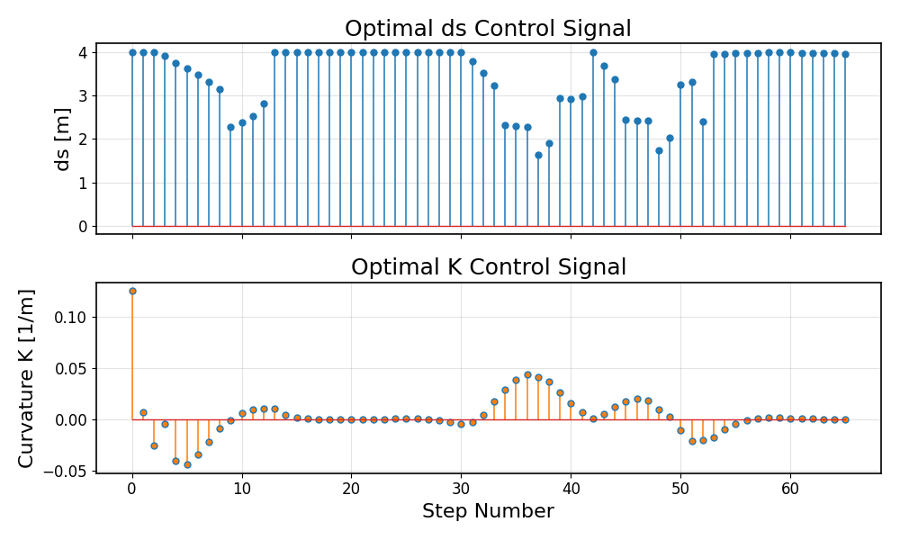
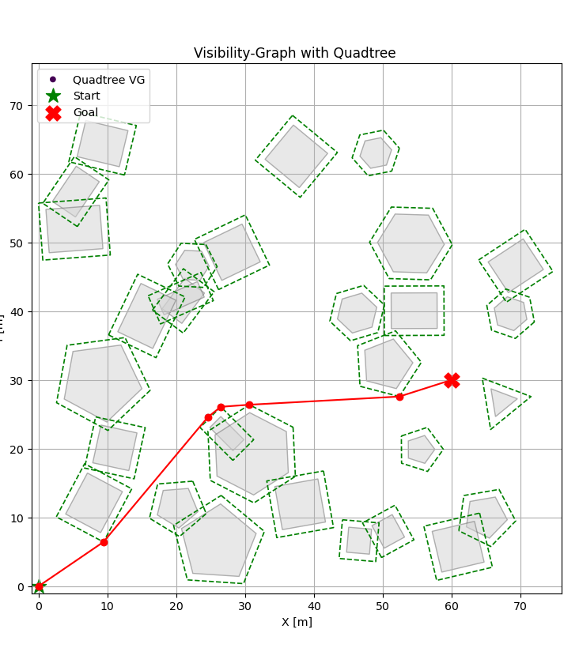
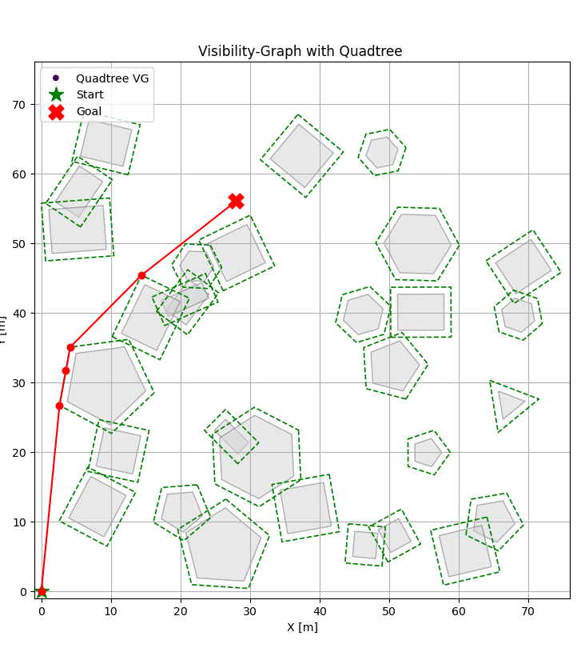

# Curvature-Based Path Planning  
*A Kinematic Approach for Real-Time Path Planning and Predictive Navigation*

  
  

---

## Path Planning Methodology

This project introduces a **curvature-based kinematic path planning method** for Unmanned Surface Vessels (USVs).  
The goal is to generate collision-free, dynamically feasible routes that respect **minimum turning radius**, **curvature continuity**, and **obstacle avoidance**.  

---

### 1. Curvilinear Kinematic Formulation

Vessel motion is reformulated in arc-length coordinates:

$$
\frac{dx}{ds} = \cos(\chi(s)), \quad
\frac{dy}{ds} = \sin(\chi(s)), \quad
\frac{d\chi}{ds} = \kappa(s)
$$

- $$\( \chi \)$$: course angle (tangent direction)  
- $$\( \kappa(s) \)$$: curvature profile along the path  
- $$\( s \)$$: arc length (progress along the path)  

**Speed-dependent turning constraint:**

$$
|\kappa(s)| \leq \kappa_{\max}(u) := \frac{1}{R_{\min}(u)}
$$

where \( R_{\min}(u) \) is the minimum turning radius at speed \( u \).  

---

### 2. Sinc-Based Discretization  

For numerical integration, a **sinc-based update** is used.  
This unifies straight ($\kappa = 0$) and curved ($\kappa \neq 0$) motion in a single formula:

$$
x_{k+1} = x_k + \Delta s \cdot \mathrm{sinc}\left(\tfrac{\Delta \chi}{2}\right) \cos\left(\chi_k + \tfrac{\Delta \chi}{2}\right)
$$

$$
y_{k+1} = y_k + \Delta s \cdot \mathrm{sinc}\left(\tfrac{\Delta \chi}{2}\right) \sin\left(\chi_k + \tfrac{\Delta \chi}{2}\right)
$$

with

$$
\Delta \chi = \kappa_k \cdot \Delta s, 
\quad 
\mathrm{sinc}(x) = \frac{\sin(x)}{x}, 
\quad 
\mathrm{sinc}(0) = 1
$$  

This ensures continuity at $\kappa \to 0$ and eliminates discontinuities between straight and curved segments.  

---

### 3. Hierarchical Planning Pipeline  

The planning framework has **two levels**:  

#### (a) Global Path Planning  
- Builds a **visibility graph** over quadtree-sampled free space.  
- Uses A* search to generate a collision-free waypoint chain.  
- Efficient, but curvature-agnostic.  

#### (b) Local Refinement (NMPC Smoothing)  
- Refines waypoints using **Curvilinear NMPC**.  
- Decision variables: \( \kappa_k, \Delta s_k \)  
- Constraints:  

$$
|\kappa_k| \leq \kappa_{\max}(u_k), \quad \Delta s_k \geq 0, \quad \text{obstacle clearance}
$$  

- Stage cost:  

$$
\ell_k = w_p \| [x_k, y_k] - [x^{ref}_k, y^{ref}_k] \|^2+ w_\kappa (\kappa_k - \kappa_{k-1})^2+ w_s (\Delta s_k - \bar{s})^2
$$  

- Solved with **CasADi + IPOPT**.  

The result is a smooth, dynamically feasible reference trajectory without curvature discontinuities.  

---

### 4. Results  

- **Sharp waypoint turns** are replaced by **feasible arcs**.  
- **Adjustable turning radius** shows trade-off between path length and maneuverability.  
- **Obstacle-rich environments**: VG (global) + NMPC (local) ensures both collision avoidance and curvature feasibility.  
- Computation time: **20–30 ms per NMPC step** on Intel i7-11800H → suitable for real-time implementation.  
## Results

### Environment Test 1
Visibility Graph + Smoothed Path:

Optimal control signals (ds and curvature K):

---

### Environment Test 2
Visibility Graph + Smoothed Path:

Optimal control signals (ds and curvature K):

---

### Long-Range Route Examples
Smoothed trajectories for larger environments:

  

---

@inproceedings{Buyukcolak2025Curvature,
  title={Curvature-Based Vessel Motion Modeling: A Kinematic Approach for Real-Time Path Planning and Predictive Navigation},
  author={Büyükçolak, Ferhan and Tayyar, Gökhan Tansel},
  booktitle={A. Yücel Odabaşı Colloquium Series: 5th International Meeting on Advances in Marine Robotics and Autonomous Systems},
  year={2025},
  address={Istanbul, Turkey}
}

